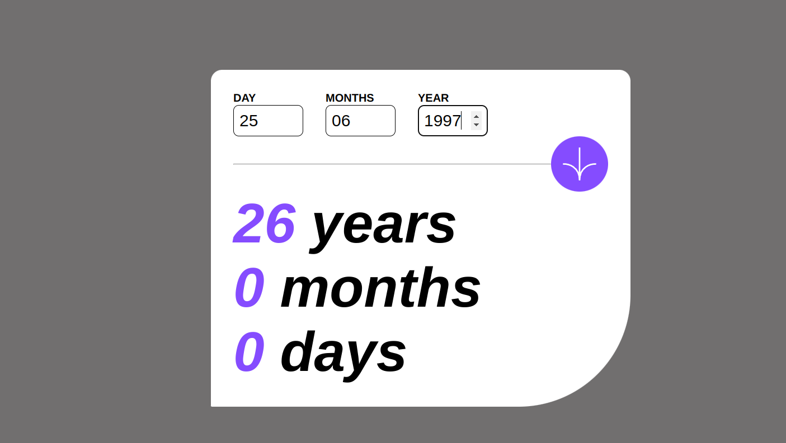

# Frontend Mentor - Age calculator app solution

This is a solution to the [Age calculator app challenge on Frontend Mentor](https://www.frontendmentor.io/challenges/age-calculator-app-dF9DFFpj-Q). Frontend Mentor challenges help you improve your coding skills by building realistic projects.  

## Table of contents

- [Overview](#overview)
  - [The challenge](#the-challenge)
  - [Screenshot](#screenshot)
  - [Built with](#built-with)
- [Author](#author)

## Overview
Hello there! Welcome to my first completed challenge by Frontend Mentor. This challenge focuses on creating a versatile and visually appealing component to summarize results in your projects.   
### The challenge

Users should be able to:

- View the optimal layout for the interface depending on their device's screen size
- See hover and focus states for all interactive elements on the page

### Screenshot

### Links
- Live Site URL: [Result summary Challenge by Mystiuk] (https://)

## My process

### Built with

- Semantic HTML5 markup
- CSS custom properties
- Flexbox
- CSS Grid
- Mobile-first workflow
- JavaScript

## Author

- LinkedIn - [Dmytro Mystiuk]([https://www.your-site.com](https://www.linkedin.com/in/dmytro-mystiuk-404a3a206/))
- Frontend Mentor - [@Mystiuk]()

